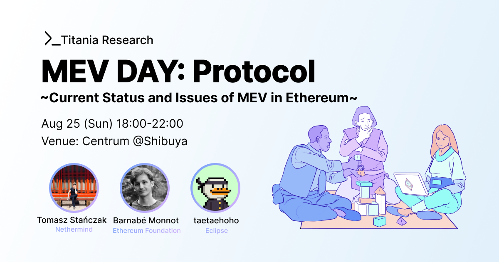

# MEV TOKYO 🗼🚀

https://docs.google.com/presentation/d/11pwYl41WdwQQGujyBmF1FU6sb97FVByZn75HsTBOBqA/edit?usp=sharing

## Overview 📝

- MEV TOKYO is an Ethereum research house and event held in Tokyo. It focuses on exploring issues such as MEV, staking, and LVR.

- The research house will run from Aug 20 - 27, with side events taking place on the 25 and 26.

- Organized by [Titania Research](https://titaniaresear.ch/), it will bring together Ethereum researchers, engineers, and community members.

## Purpose 🧭

The aim of MEV TOKYO is to contribute to problem-solving in Ethereum by sharing practical insights and facilitating discussions on complex issues. By examining incentive problems from both protocol and application perspectives, we aim to create opportunities for new insights and realizations. We provide a space for emergent community discussions, promoting problem-solving to expand Ethereum as a free space for humanity.

## Facilities and Program 🖥️

### Research House (at Shibuya) 🏠: Aug 20 - 27
- 8 private rooms
- Capacity for 10-15 people
- Short-term research house for those involved in Ethereum incentives
- Discounted stays available for community members (closed space, not openly recruited)
- Research house participants have access to [coworking space](https://centrum.studio/)
- Runs from Aug 20 - 27

### Events 🎫: Aug 25 - 26
- Creating a space for discussion by inviting researchers, engineers, and Ethereum stakeholders from around the world as speakers
- Held on Aug 25 and 26
- Venue: [Centrum](https://centrum.studio/)

#### Aug 25 (Sun): Protocol DAY

- Content related to protocol incentives such as PBS, APS, Staking economics and sequencing rules.
- Speakers:
  - [Tomasz Stańczak](https://x.com/tkstanczak) from Nethermind
  - [Barnabé Monnot](https://x.com/barnabemonnot) from Ethereum Foundation
  - [taetaehoho](https://x.com/0xtaetaehoho) from Eclipse
  

If you are interested in attending the event, please apply using the following page:

https://lu.ma/ei1byzjh

#### Aug 26 (Mon): Application DAY

- Content related to application incentives such as Sequencing (Based Preconfirmation, L2 sequencing), intents, LVR and DEX.
- Speakers: 
  - [Yuki Yuminaga](https://x.com/ballsyalchemist) from Sorella Labs
  - [Ugur Mersin](https://x.com/ugurmersin61?s=21&t=aRdEi_d8jttLkTojlCOoLA) from API3
  - [bt3gl](https://github.com/mia-stein) from urani.trade
  - Markus from [PropellerHeads](https://x.com/PropellerSwap)

If you are interested in attending the event, please apply using the following page:

https://lu.ma/9ha1tvgh

## What We Are Not 🚧
- We don't prefer hosting large parties and strive to maintain the house as an intimate space where small groups can gather and enjoy meaningful conversations.
- The research house does not support team building. Please apply to ETH Tokyo individually. Even if you apply as a team, the entire team cannot participate together (each team member will be evaluated individually).
- Our house is not a hacker house, but a research house. It is not a place to work on projects, but a place to discuss and research Ethereum.

## Sponsorship 🤝

Now we are supported by Ethereum Foundation (ESP) and Mycel, API3.

## Application Form 📝
If you are interested in being a speaker, sponsor, or staying at the house, please apply using the following form:
https://noteforms.com/forms/mev-tokyo-form-8cbw2s

## Past Activities 📜
### MEV Tokyo Salon
- Gathered about 60 [participants](https://x.com/keccak254/status/1716307800316608721) for discussions on MEV.
- It was held in Tokyo on Oct 21, 2023.

### Titania Research House
- A small share house where researchers & engineers gathered.
- Had about 30 visitors and hosted [several events](https://titaniaresear.ch/titania-research-house1).

## Contact 📞
This event is organized by [Titania Research](https://scandalous-stick-9ab.notion.site/Titania-Research-Homepage-587cd20f07b14d259fa7d5c8d9646fc9) members, mainly [vita](https://x.com/keccak254) and [banri](https://x.com/banr1_).

Please contact us at telegram(keccak255) or Email(keccak255@gmail.com) if you have any questions or would like to sponsor the event.

## House Pictures 🏡

