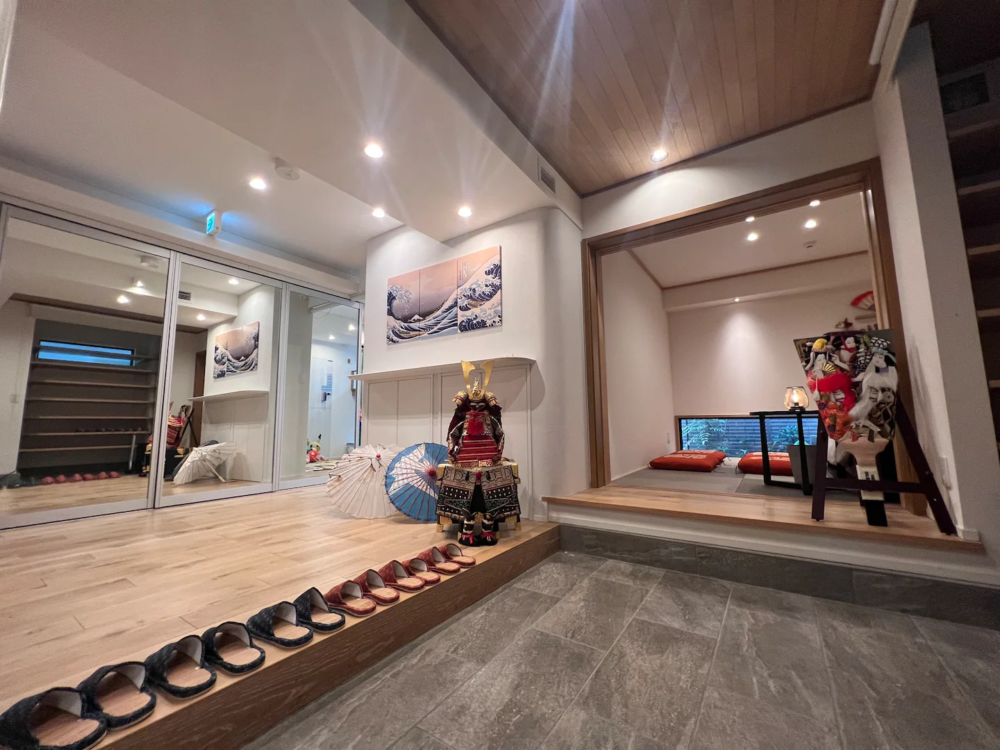
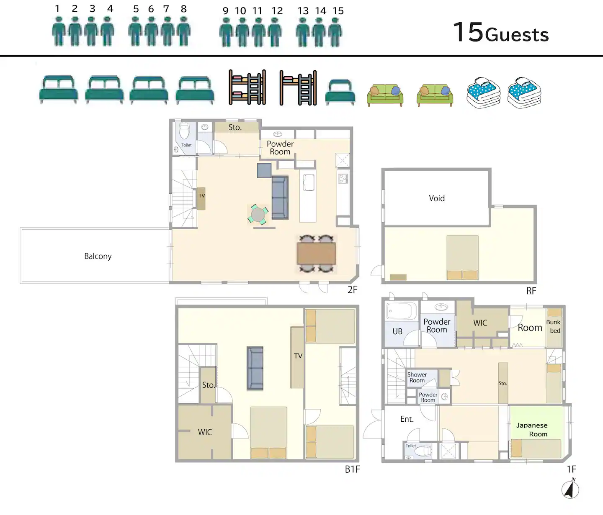

# MEV TOKYO 🗼🚀

## Overview

- MEV TOKYO is an Ethereum hacker house and event held in Tokyo. It focuses on exploring issues such as MEV, staking, and LVR.

- The hacker house will run from August 21-28, with side events taking place on the 25th and 26th.

- Organized by Titania Research, it will bring together Ethereum researchers, engineers, and community members.

## Purpose

The aim of MEV TOKYO is to contribute to problem-solving in Ethereum by sharing practical insights and facilitating discussions on complex issues. By examining incentive problems from both protocol and application perspectives, we aim to create opportunities for new insights and realizations. We provide a space for emergent community discussions, promoting problem-solving to expand Ethereum as a free space for humanity.

## Facilities and Program

### Hacker House (Shibuya Area)
- 8 private rooms
- Capacity for 10-15 people
- Short-term research house for those involved in Ethereum incentives
- Discounted stays available for community members (closed space, not openly recruited)
- Hacker house participants have access to coworking space
- Runs from August 21-28

### Events
- Creating a space for discussion by inviting researchers, engineers, and Ethereum stakeholders from around the world as speakers
- Held on August 24-25

### August 25: Protocol DAY
- Content related to protocol incentives such as PBS, MVI, and timing games
- Speakers: 4 people
  - (To be added as confirmed)

### August 26: Application DAY
- Content related to application incentives such as LVR and Intents
- Speakers: 4 people
  - (To be added as confirmed)

## What We Are Not
- We don't prefer hosting large parties and strive to maintain the house as an intimate space where small groups can gather and enjoy meaningful conversations.
- The hacker house does not support team building. Please apply to ETH Tokyo individually. Even if you apply as a team, the entire team cannot participate together (each team member will be evaluated individually).

## Sponsorship

One package: $4,000

- Ability to stay at the hacker house
- Distribution of swag and flyers
- Opportunity for a 5-10 minute speech

## Past Activities
### MEV Tokyo Salon
- Gathered about 60 participants for discussions on MEV.

### Titania Research House
- A small share house where Ethereum researchers gathered.
- Had about 30 visitors and hosted several events.

## House Pictures

